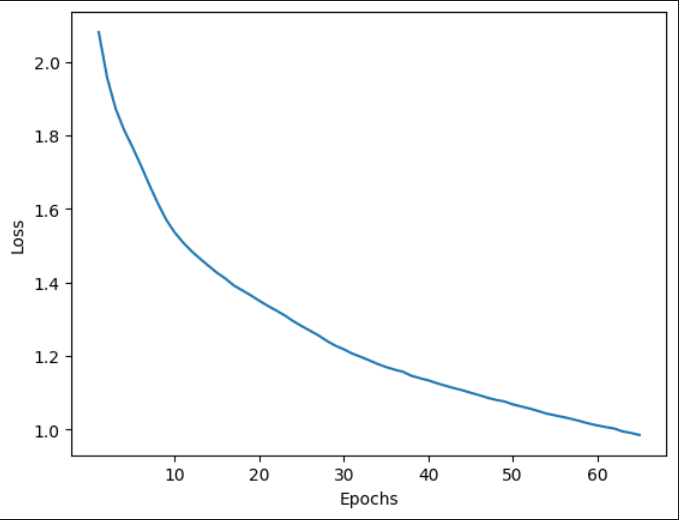
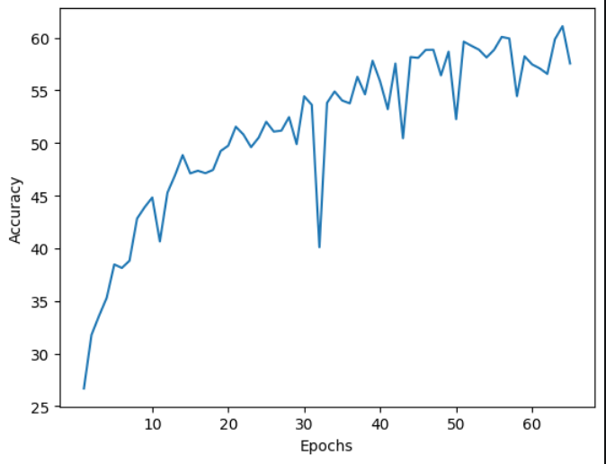
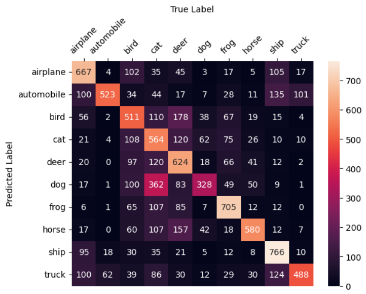
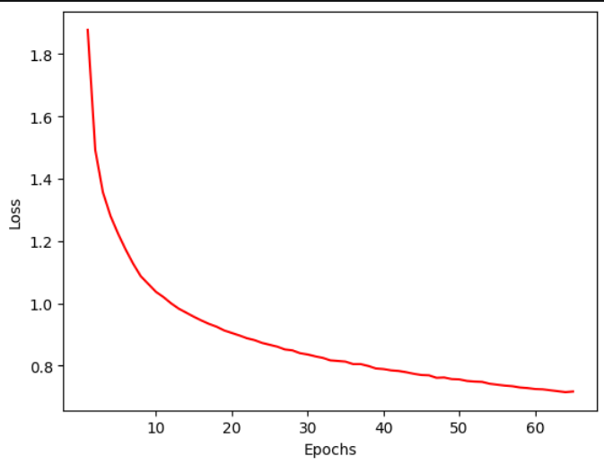
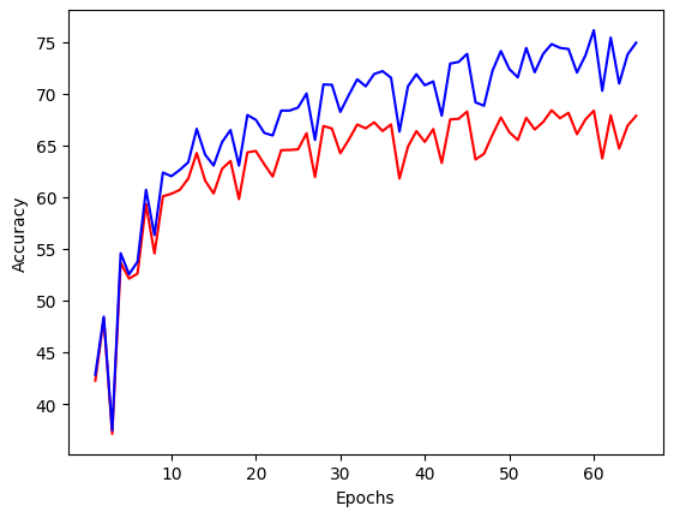
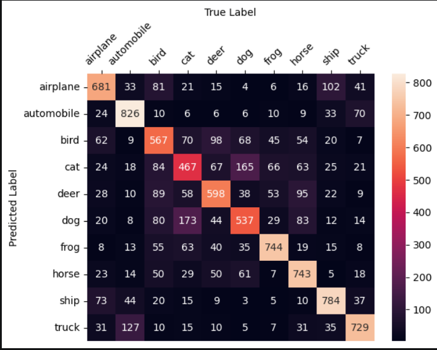
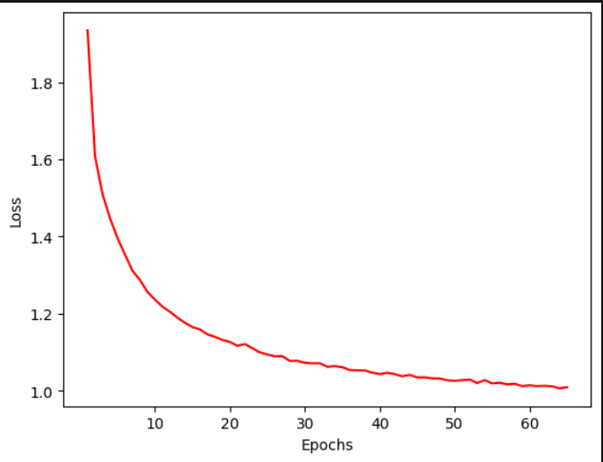
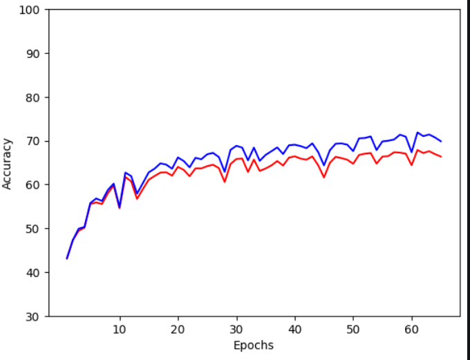
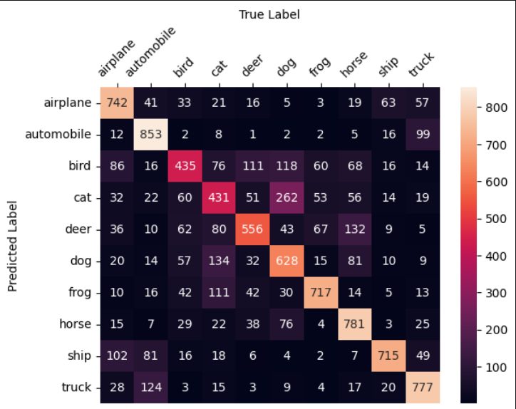

# CNN_Analysis
Analysis on Different CNN Architecture on **Cifar-10 Dataset** 

## Architecture 1 : Modified LeNet 

#### For the first CNN Architecture I used a modified LeNet Architecture with few changes in kernel size,  number of convulational filters and used reLU instead tanh 

**First Test :  Accuracy Reached - 59.56%**
1. No Normalization , No resizing or Augementation 
2. 65 epochs , Batch size : 64 
3. Fixed Learning rate, lr = 0.01 
4. Optimizer : SGD , Loss : CrossEntropyLoss

### Graphical Analysis 

** Epoch vs Loss **

**Accuracy for each label prediction**
    
    Accuracy of airplane : 66.70 %
    Accuracy of automobile : 52.30 %
    Accuracy of bird : 51.10 %
    Accuracy of cat : 56.40 %
    Accuracy of deer : 62.40 %
    Accuracy of dog : 32.80 %
    Accuracy of frog : 70.50 %
    Accuracy of horse : 58.00 %
    Accuracy of ship : 76.60 %
    Accuracy of truck : 48.80 %

After normalization

    Accuracy of airplane   : 62.80 %   (decreased -3.90)
    Accuracy of automobile : 71.90 %   (increased +19.60)
    Accuracy of bird       : 51.90 %   (increased +0.80)
    Accuracy of cat        : 40.10 %   (decreased -16.30)
    Accuracy of deer       : 56.90 %   (decreased -5.50)
    Accuracy of dog        : 56.60 %   (increased +23.80)
    Accuracy of frog       : 78.20 %   (increased +7.70)
    Accuracy of horse      : 72.90 %   (increased +14.90)
    Accuracy of ship       : 68.20 %   (decreased -8.40)
    Accuracy of truck      : 87.10 %   (increased +38.30)

After Normalization + Batch Normalization

    Accuracy of airplane   : 68.10 %   (increased +5.30)
    Accuracy of automobile : 82.60 %   (increased +10.70)
    Accuracy of bird       : 56.70 %   (increased +4.80)
    Accuracy of cat        : 46.70 %   (increased +6.60)
    Accuracy of deer       : 59.80 %   (increased +2.90)
    Accuracy of dog        : 53.70 %   (decreased -2.90)
    Accuracy of frog       : 74.40 %   (decreased -3.80)
    Accuracy of horse      : 74.30 %   (increased +1.40)
    Accuracy of ship       : 78.40 %   (increased +10.20)
    Accuracy of truck      : 72.90 %   (decreased -14.20)

After Normlization + Batch Normalization + Dropouts 

    Accuracy of airplane   : 74.20 %   (increased +6.10)
    Accuracy of automobile : 85.30 %   (increased +2.70)
    Accuracy of bird       : 43.50 %   (decreased -13.20)
    Accuracy of cat        : 43.10 %   (decreased -3.60)
    Accuracy of deer       : 55.60 %   (decreased -4.20)
    Accuracy of dog        : 62.80 %   (increased +9.10)
    Accuracy of frog       : 71.70 %   (decreased -2.70)
    Accuracy of horse      : 78.10 %   (increased +3.80)
    Accuracy of ship       : 71.50 %   (decreased -6.90)
    Accuracy of truck      : 77.70 %   (increased +4.80)

Note : Changes (increase/decrease) is measured relative to previous change

### Conclusion from First architecture. 
The Test data accuracy jumped from 59.56 % to 64 % when I used standardization $\frac{X - \mu}{\sigma}$ on input data. This improved the model performance As the values where concentrated in a fixed range and ensuring each feature input is in same similar range and is zero centered. Which helped the model with more optimized and more stable gradient descent step and faster convergence by enusuring a smoother loss function. 
When I used Batch normalizaton (in second conv layer) there was a improvement in model performance increasing the accuracy from 64% to 66%. 
Batch normalization works on intermediate data in neural network standardize and then maybe Affine Transform which and stabalizes activation distribution, helps in faster training  and reduces internal covariate shift although mordern reasearch in this argues if internal covariate shift is a real problem or not *** . We implement this using 
$A' = \left(\frac{A - \mu}{\sigma}\right)\gamma + \beta$, 
where mean and std are calculated from the batch of output from activation function and γ, β are trainable parameter. 

However It did not gave any significant improvement. I think this is because of overfitting which can be seen from graph the model is trying to memorize features based on training data (training accuracy was 78 % while on Test data 66 %), Suggesting overfitting of model.  This could be due to various reason one being the model not being deep and lacking of enough conv layers stopping it to catch complex features. 

I analysed the confusion matrix that concluded that the model was struggling to classify animals It was classified Cat as Cat (467 times) while Cat as dog and deer as 165 and 67 respectively. Similar for other animals. 

### Below are the plot or epoch vs loss , epoch vs accuracy and confusion matrix [with Batch normlization implemented]

### After Adding dropout in FC1

The Test data accuracy only increased by 0.94 % (66% -> 66.94 %) and Train accuracy reduced by 3.71 % . The model didn't get any beter. This suggest the model is not able to catch complex features from the images. Although the generlization gap reducing the overfitting problem to some extend. 

This suggests that this model lacks sufficient capacity to extract complex feature limiting model overall performance and significant further improvements are unlikely without architectural changes, though training and augmentation strategies still provided minor gains( I didn't experimented much with augementation on this model, We will do that in our later model), We have to add few more layers to add complexity and help model do better generelization, regularization is insufficient for this model.

Final Summary (Modified LeNet-5)

| Configuration       | Test Accuracy |
| ---------------     | ------------: |
| Baseline Model      |        59.56% |
| + Normalization     |        64.00% |
| + BatchNorm         |        66.00% |
| + Dropout           |        66.94% |
